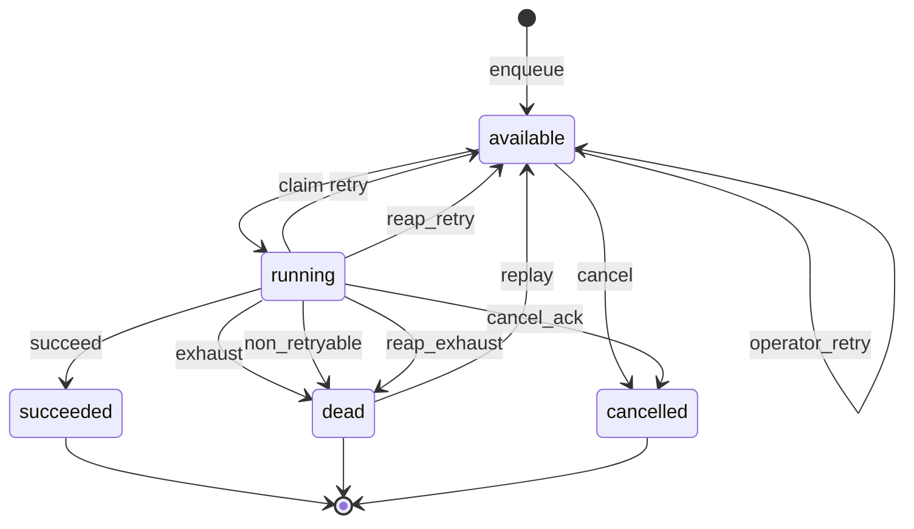

# Job state machine

> **Generated file.** Produced from `packages/core/src/engine/state-machine.ts` by
> `npm run gen:docs`. Do not edit by hand; change the transition table instead.

Both the worker path and the administrative path route every mutation through
`assertTransition`, so no operation can produce a state this table does not permit.

## States

| State       | Claimable | Terminal |
| ----------- | --------- | -------- |
| `available` | yes       | no       |
| `running`   | no        | no       |
| `succeeded` | no        | yes      |
| `dead`      | no        | yes      |
| `cancelled` | no        | yes      |

Names avoid "pending", "queued", "completed", and "failed" deliberately: those are
ambiguous about whether a retry follows. A job whose handler threw is back in
`available` when attempts remain, so calling it "failed" would be wrong.

## Diagram

## Transitions

| From        | To          | Reason           | Description                                                                    |
| ----------- | ----------- | ---------------- | ------------------------------------------------------------------------------ |
| `available` | `running`   | `claim`          | A worker claimed the job; attempt is incremented in the same statement.        |
| `available` | `cancelled` | `cancel`         | An operator cancelled a job that had not started.                              |
| `running`   | `succeeded` | `succeed`        | The handler resolved and the owning worker recorded completion.                |
| `running`   | `available` | `retry`          | The handler failed with attempts remaining; run_at set to a jittered backoff.  |
| `running`   | `dead`      | `exhaust`        | The handler failed on the final permitted attempt.                             |
| `running`   | `dead`      | `non_retryable`  | The handler signalled a non-retryable failure; remaining attempts are skipped. |
| `running`   | `available` | `reap_retry`     | The lease expired with attempts remaining; the reaper recovered the job.       |
| `running`   | `dead`      | `reap_exhaust`   | The lease expired on the final attempt; no worker survived to report.          |
| `running`   | `cancelled` | `cancel_ack`     | The worker acknowledged an operator cancellation request.                      |
| `dead`      | `available` | `replay`         | An operator replayed a dead-lettered job; attempt resets to zero.              |
| `available` | `available` | `operator_retry` | An operator moved run_at to now; does not consume an attempt.                  |

## Permitted targets by state

- `available` → `running`, `cancelled`, `available`
- `running` → `succeeded`, `available`, `dead`, `cancelled`
- `succeeded` → _(terminal)_
- `dead` → `available`
- `cancelled` → _(terminal)_

## Two rules worth reading twice

**`attempt` increments at claim time, not at failure time.** A worker that dies
without reporting anything still consumes an attempt. Without this, a job that
reliably kills its worker — an out-of-memory payload, say — would retry forever,
taking down worker after worker. The cost is that an unrelated crash also burns an
attempt, which is why `max_attempts` defaults to 5 rather than 2.

**`running → cancelled` requires worker acknowledgement.** An operator cancelling a
running job sets `cancel_requested_at`; the worker sees it on its next heartbeat and
aborts the handler. The job stays `running` until the worker agrees or the lease
expires. Marking it cancelled unilaterally would report a state the executing process
has not agreed to, when its side effects may already have happened.

## Counts

11 permitted transitions across 5 states,
3 of them terminal.
